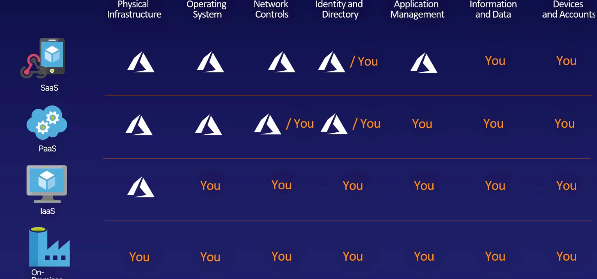

# Introduction 
## ARM Templates
- A declarative way to specifiy an action that so it can be easily reproduces. 
# Cloud Concepts
What is cloud computing: 
Cloud computing is the on demand availbility split into three main categories compute, network, and storage.
## Language Of Cloud Computing
- High Availbility: You don't own any of the servers but you can get as many as you want with a click. Instant replacement of harware, 
- Reliability: The ability of a system to recover form failures and continue to funciton. 
- Scalability: The process of adding resources on an as needed basis. Automatically or manually scale up, out or down
    -  Horizontal scaling is the process of adding additional vms or containers. aka scaling out
    - Vertical scaling: increasing the power of the already exisiting machines. 
- Predictability: 
    - predictable performance: 
        - Consistent experience for customers regardless of traffic. 
    - predictable cost: 
        - No unexpected surprises
        - Tracking resource
- Security:
    - Full control of the security of your cloud environment. 
- Governance: 
    - The ability or capability to regulate the environments and Standarize envirionments
- Manageabilty: 
    - Autoscaling, Monitoring
    - Management in the cloud
## The Cloud Economic Language
- Capital Expenditure (CapEx)
    - Money spent by a business or organization or acquiring or maintaining fixed assets, such as land, buildings, and equipment. (OpEx)
- Operational Expenditure
    - An ongoing cost for running a product, business, or system on a day-to-day basis, including annual costs.
 
## Cloud Service Models

## Cloud Architect Models
- Private Clouds
    - Pros: 
        - Complets control of infrastructure
        - Benefits of public cloud
        - Better security and privacy
    - Cons: 
        - Maintenace
- Public Clouds 
    - Pros: 
        - No purchase of hardware 
        - Low monthly fees
    - Cons: 
        - No Control over features and versions
        - No physical access
- Hybrid Clouds
    - Pros:  
        - Avoid disruptions and outages
        - Adhere to regulation, governance
        - Span both public and private cloud
        - alleviate CapEx investments
    - Cons: 
        - Complex infrastructure
# Azure Architecture 
## Regions and Availabilty Zones
- Region: are two or more datacenters not to far from each other that are connected via fiber opt cable
- Availabilty Zone: it is a physical location within a region that has its own power cooling and network.
## Resource Groups and Azure Resource Manager
- All resources must be in a resource group
    - A resource can be in only one resource group at a time
    - You can add and remove resources at anytime 
    - You can move resources between groups. 
    - Resource groups can have resources from multiple regions
# Compute 
## Virtual Machines
- A Computer or server that you have exclusive access to but it share hardware with other machines. 
- The price is calculated hourly. 
- Pros: 
    - Allows you to control all aspects of the environment or the machine
    - Install specific applications on your windows or linux machines 
    - Easy to transfer on-premise machines to virtual machines
- Cons: 
    - Other azure services do something better then the virtual machine
    - There is a lot of maintenance that comes with the vm like operating systems updates,patches, security. 
## Scale Sets
- They let you create and mange multiple identical virtual machines. It helps you to scale out easily and reliably. You can use scale sets to spin up virtual machines as needed and take them down as needed automatically
## App Services
- App services are PaaS. 
- There are web app, Api apps, and container instances. 
## Azure Container Intances
- Containers: Virtual boxes that hold all the dependencies and what ever your application needs to run so that you can ship it easily. They have less overhead and increased portability.
## Azure K8s Services
- It is greek for governer and captain. 
- It is an open-source container orchestration system for automating application deployment, scaling and management.
- Azure K8s comes with all the standard azure services.
- Node is a machine/application
- A cluster is a set of nodes that run containerized application managed by k8s
## Azure Virtual Desktop
- This is a virtual desktop that is hosted on the cloud. 
## Functions 
- Functions: Is the smallest compute service on Azure. A single function of a compute. Called, or invoked, via a standard web address. Runs once and stops.
- They use a vitual machine to run on but you don't have do anything to configure that virtual machine. They are "serverless".
# Networking
## Virtual Networks
- Vnets are virtual networks becuase we don't get access to the actual hardware that the network is running on. 
- Address space is the rage of IP Addresses that are available.
- A Subnet lets you segment the network into smaller networks of the vnet and you can allocate an address space to each subnet. This allows for resource to be grouped together and for you to secure that section on the network. 
- Vnet Peering: Allows you to connect to or more virtual networks in azure. Machines that use Vnet peering never go into the public IP space which helps with security and helps reduce latency. 
## Load Balancer
- A load balancer distributes new inbound flows that arrive on the load Balancer's front to backend pool instances according to rules and health probes.
## VPN Gateway
- Vnet Gateway are two or more machines on the Vnet that exist in a subnet of the Vnet called the gateway subnet.
- VPN Gateway is a specific type of  Vnet gateway that is used to send encyped traffic over the public network to an on-premises infastructure. 
- Main Compontents 

## Application Gateway
- Application Gateway lets you route traffic based on other attribute then IP address and port number. Such as the data format, the type of request, the URI path ect. 
- It can scale up and down depending on traffic and have end to end encryption. It can host multiple websites so you don't need a new one for every application that you make. 
## CDN Content Delivery Network
- A CDN is a Distributed network of servers that can deliver web content close to users. 
- The have edge nodes that are copies of the data that are placed closer to the users. This is done through caching the you can tell the cache how often you want it to check for updates. 
- Cache is a temporary copy of original files
- origin server is the master file that caches are based off of.
## ExpressRoute
- A super fast connection into the bowels of azure that is secured, private and high bandwith. 
# Storage 
- A storage account is a unique Azure Namespace. It is global and unique
## Blob
- BLOB: is short for Binary Large Object.  Blobs of data are stored in a container in the storage account. 
- there are Block Blobs, Append Blobs and Page Blobs.

## Disk 
- Also refered to as a managed disk. It is what comes with you vms. 
- There are four main disk types that can come with you vm. 

## File 
- This is the storing of files that would normally take a lot of infastructure to maintain on-premise azure can handle it for you. It allows you to have unlimited storage and easily share files securely. 
## Archive
- This is for data you need to keep but aren't really going to be using. It is low cost but not very fast because it doesn't need to be. This is a Blob storage tier. 

## Storage Redunancy 
-  This is used to help protect against data failures. 
- This proccess in azure happens behind the scene and is almost completely invisable to the azure user. 
- You do, however, get to choose different redundancy options. The higher availabilty will inccur a higher cost. 

- Local redundant storage: Three copies of your data in a single location and is the lowest cost option. Doesn't protect against zone or regional outage
- Zone redundant Storage: You have three copies of your data stored across three availability zones. protects against a zone outage but not a region outage. 
- Geo-Redundant Storage: Three copies in a primary regional physical location. And additional three copies in a secondary paired region physical location
- Geo-zone-redundant Storage: This is the same as the geo-redundant storage but includes that the storage in that region is spread across the availability zones.
## Moving Data
- Az Copy: used for ocassional copying of data and is a command line option. 
- Storage Explore: Is a Downloaded application and is a more user friendly graphical interface. Allows you to simply drag and drop you files easyily.
- Azure File Sync: Provides local file server performance + cloud Availability. Allows you to sync on premise files with other on premise systems at a different location.

## Additional Migration Options
- Azure Data Box: This is used for limited bandwith scenarios or needing to transfer a lot of data meaning to much to transfer orver the internet. Copy data toe a physical data storafe Device(data box) and then ship it to azure and they will upload it for you. It also works in reverse. 
- Azure Migrate: Mirgrate non-Azure resources into Azure i.e servers, databases, applications.
## Premium Performance Options
- The better preformance is at the cost of redundancy

#### Summary

# Database 
## Cosmos DB
- Provides the ability to be global right out of the box. Azure takes cares of the tranfer and keeping data consitent between regions. Supports a lot of different languages.
## Azure Sql
- This is a database as a service. Can be used to migrate your on-premise DB to Azure Sql. Has a ton of space and is secure. 
- there are _two_ products 

## MySql
- open source product that is maintained by the community. 
- It is Paas. You can use any language to program with it.
## PostgresSql
- open source relational database. It is free and the default database for mac os.
## Database Migration Services
- The default azure migration tool. There is a lot of documentation for it and you can use the one tool to migrate your services.  
# Authentication and Authorization 
## Identity Services 
- Authentication vs Authorization. 

## Azure Active Directory(AAD)
- Designed for on premise-users. 
- Tenant: is a dedicated instance of AAD that an organization receives when singing up for azure. It is the first thing that is created in an azure account. Each tenant is unique. Each user in Azure can be a member or guest of up to 500 AAD tenants.
- Subscription: The entity that is billed for the use of resources. If a subscription isn't paid all the resources and services associated with the subscription stop.
- It works well for hybrid cloud archetechtures
## Zero Trust Concepts
- Trusted permimeter: Restricts private access to secure networks. You can only access the information if you are inside the trusted perimeter. 
- Zero Trust: Assume that everyone regardless of where they are (inside or outside a perimeter) are not to be trusted. You become trusted via your identity and it functions on a Least privilage access - just enough permission to do a job. It is based on trusted identies not on a trusted location. 
## Multi-Factor Authentication
- It is when you need at least two ways of authentication to gain acess. There are different layers and 2fa id made up of at least two of the following, Something you know, Something you have, or something you are.
## Conditional Access 
-  They are a premium features that are built into AAD that provides different forms of authenitcaiton above just a user name and password. If user meets certain conditions then grant/block access to defined applications.
## Passwordless 
- Security vs Convenience. Passwordless is trying to make the best of both worlds of security and convenience. Once you have been authenticated once you remove the password part of the authentication and replace it with something you have or something you know(On a device) Like a finger print or a pin.
- ways azure does passwordless

## External 
- How to properly cooperate with users outside of the organization. 

- invite the user. AAD allows you to configure the identity providers that you are allowed to invite.

## Azure Active Directory
## single sign-on 
- lets you sign in once and be authenticated for multiple application. It is called Seamless Single Sign-On

# Azure Solutions
## Internet of things AKA IOT
- A system of interrelated computing devices, mechanical and digital machines, object animal or people that are provided with unique identifiers and the ability to transfer data over a network without requiring human-to-human or human-to-computer interaction. 
- IOT hub: Is the backend that all your things that you connect to. It is a Paas.
- IOT Central: Saas. No code for this one and provides a bashboard to connect and manage you data. Has a lot of ready made solutions 
- Azure Sphere is the all in one solution for IOT devices. 
## Big Data
- Data lake analytics: Data lake is a large body of data that allows parallel processing allowing you to make process large amounts of data.
- Azure HDInsight: Uses all open source frameworks to do the samething that Data Lake
- Databricks: Based on Apache Spark, a distributed cluster-computing framework. allows you to run and process a dataset on many computer simultaneously. Azure provides that computing power so you don't have to buy a bunch on computers
- synapse analytics: Azures's data warehouse offering. Used for reporting and data analysis. It is in the cloud so it is only constrained by your wallet. provides synapse sql to manipulate the data
## Machine Learning
- AI: The capabiltiy of machines to imitate intelligent human behaviour. 
- Models: A set of rules of how to use the data provided
- Kowledge Mining: Used to find existing insights in your data
- Built-in Apps: Azure has a few built in apps that you can use for machine learning ans AI straight away.
- Azure bot service: is a Paas that can be used to build your own bot. You can use the visual composer or by programming it your self.
- Azure Cognitive Services: 
    - vision: Used to recognize, identify and caption your videos and images automatically.
    - Decision: Make decisions based on content. Detect potential offensive language, deect IoT anomalies and leverage data analytics. 
    - Speech: Automatic speech-to-text transcription. Speaker Identification and Verification.
- Machine learing studio is the main tool for using machine learing in azure. 
## Serverless 
- It is serverless in the sense that you aren't managing the servers but they are still there. 
- Azure Functions: The first serverless service that is made to perform only one single task and the function only runs once for each invocation.
- Logic Apps: Connect systems both inside and outside of the azure platform. Supports automation and there is no coding required to get started straight away. 
- Event Grid: An event is what an application uses to tell other things that happened. Event Grid is a routing services for sending and receiving events between applications.
## DevOps
- A mix of development and operations. 
- Azure DevOps
    - Azure boards 
    - Azure Piplines
    - Azure Repos
    - Azure Test Plans
    - Azure Artifacts
- Azure DevTest Labs: Allows Developer and engineers to create environments for test and development. 
- Github and Github Actions

# Security 
## Defense in Depth
- You want many layers of defense. There are 7 layers 

## Securing Network Connectivity 
- Firewalls: Has rules that protect the network. Only things that follow the rules of the firewall are let into the network
- ddos Distrubuted Denial of Services: This is a lot of computers or services that target a single server or website with the aim to make it stop. 
- NSG Network Security Group: A set of rules for who can access the group. 
- Application Security Group: This protects an application based on the application rather then an ip address. 
## Public and Private Endpoints
- Service endpoints:  

- limitations are that the on-prmise acess is still over the public ip. Service endpoints provide access to the entire service as opposed to not just a single storage account. This is not truly private because the endpoint is still open to the public. 
- Private enpoint: 

## Microsoft Defender for Cloud 
- It is a portal in the azure portal it provides threat alerts and analyses data from a bunch of azure machines to let you know if you have been attacked. Provides policy and copliance metrics, a secure score to encourage security hygiene, integrates with other cloud providers, Alerts for resources that aren't secure. 
- Process 
    - Define Plolicies 
    - Protect Resources
    - Respond to Threates
## Key Vault 
- This is a secure place to share and encrypt passwords. 
    -  storage is done on secure hardware
    - application isolation 
    - high scalability
## Azure information protection
- Secure documents, emails and data outside of the company network. 
## Microsoft defender for identity 
- You really can't trust users. Defender helps you monitor users, Identify baseline behaviors of different users and suggest changes.
- Cyber-Attack Kill Chain: The way attackers get into your systems. 

## Azure Sentinel

## Azure Dedicated Hosts
- A full physical server that you have full control of. 
- Control of the maintaince schedule. 
# Monitoring And Managements
## Governance
- A set of rules policies and roles to define acceptible use of the resources.
- Azure Policy: this a set of rule to make sure the resources are used in line with the accepitable use. 
- Role Based Access Control (RBAC): Lets you define specific roles to different users to govern what they have access to
- Locks: lock block certain actions form being preformed on resources like not being able to delete a resource or read-only.
- Azure blueprints: A template for creating azure resources. they can pack the resources with their policies. 
## Azure Monitor
- Uses telemetry to improve the azure experience
- Use azure monitor as the central point for all the telemetry to be collected and displayed. You can even send on-premise telemetery to the Azure monitor. 
## Monititoring Tools
- Log Analytics: allows you to create your own custom queries to show telemetry. You can write your own queires using KQL or Kusto Query Language.
- Application Insights: Give you insights into your web based applications. Only works with web apps. let you see preformance bottle necks in the website.
- Azure Monitor Alerts: sends out notification in response to unexpected events that might require human help. 

## Azure Service Health
- The service health dashboard notifies you about outages or accidents planned or otherwise.
## Compliance
- This is a huge task beacue compliance rules change from contry to country. 
- 
- Azure compliance manager gives you recommendations based on our resources. It also allows you to generate reports about your compliance.
- Compliance is not negotiable

## Privacy
- It is an extension of complaince. 
- Coverd in other sections in the course
## Trust

## Azure Arc
- Helps manage resources across different platforms. 
- Azure Arc: Teh ability to manage azure and non azure resources in a signle unified interface. It to manage and protect those non-azure resources. 

# Pricing
## Subscriptions
- All resources belong in a subscriotion but accounts can have multiple subscriptions.
## Management Groups
- Management goups: There can be group subscriptions that allow you to take action across subscriptions in bulk.
## Cost Management
- There are static costs and bynamic costs. This part needs to be automated. 
- There are free accounts that include a range of benefits. There are also always free services. 
- There is a cost management portal to visualize your spending. 
## Pricing Factor
- Influences: 
    - Resource size
    - Resource type
    - Location
    - Band width
- There are three billing zones and data transfer between billing zones is billed
- There is a pricing calculator that will calculate the monthly cost of the the resources you put in
- There is a calculator that caluates how much you can save by moving your resoures to azure. 
## Best Practices
- Spending Limits: When credtis runout the spending limit stops you from spending more then the limit
- There are Tags that are nonfuntional labels that help you link resources together. 
Reserving products and capacity can give you discounts. 